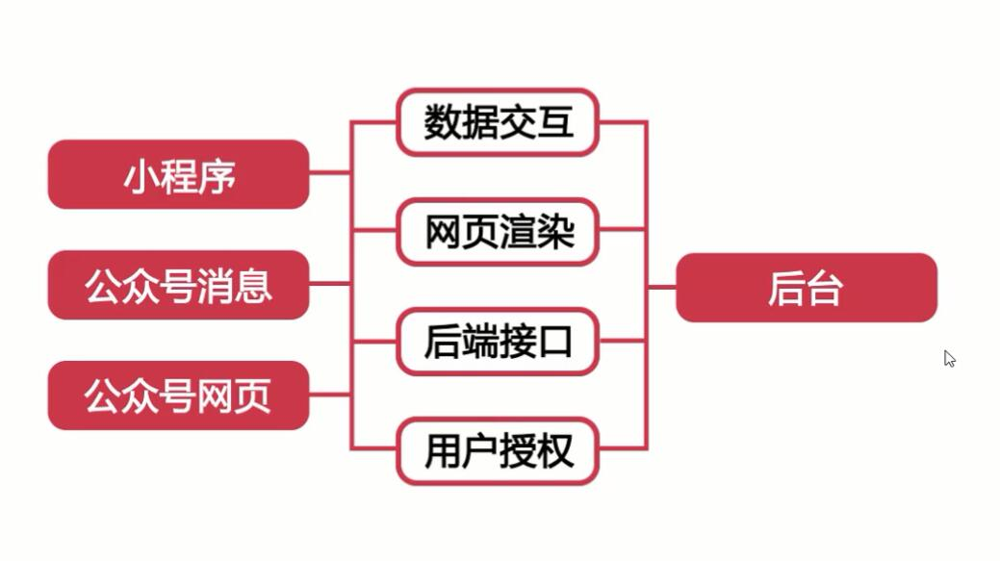
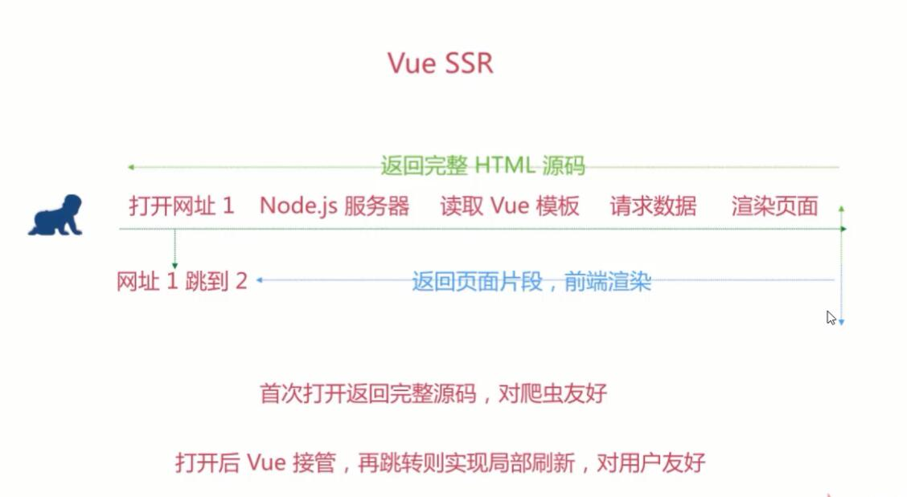
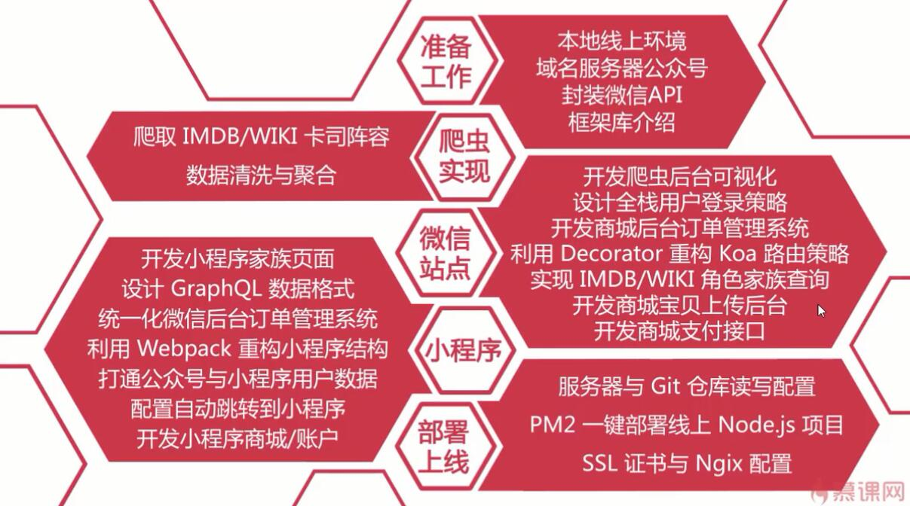
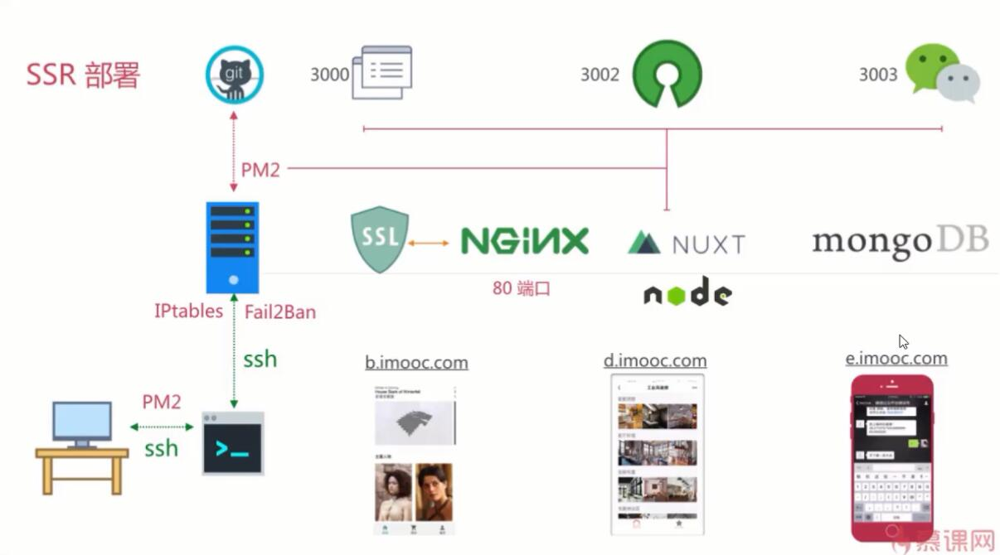

# 前端 Vue+Node+MongoDB高级全栈开发

- 视频课程出品时间：2017年年底

----

## 课程大纲
- [第1章 本地与服务器环境准备]()
    - [1-1 导学]()
    - [1-2 课程简介]()
    - [1-3 申请认证公众服务号与小程序]()
    - [1-4 选购域名与备案解析域名]()
    - [1-5 选购配置服务器]()
    - [1-6 安装 Node.js v8.0 生产环境]()
    - [1-7 配置 Vue-Yarn-PM2 工具环境]()
    - [1-8 配置 Nginx 端口代理与域名指向]()
    - [1-9 安装 MongoDB 数据库 v3.4]()
    - [1-10 配置 Git 私有仓库管理代码]()
    - [1-11 配置 PM2 一键部署发布项目]()
- [第2章 公众号小程序的服务能力与场景]()
    - [2-1 公众号主要 API 的能力解读]()
    - [2-2 小程序主要 API 能力及公众号内申请认证]()
    - [2-3 接入公众开放平台以 UnionID 统一小程序与公众号用户信息]()
- [第3章 相关框架库技术介绍]()
    - [3-1 Sass 样式预处理器]()
    - [3-2 Koa 后台 Web 框架及中间件]()
    - [3-3 Webpack 打包构建工具重构小程序(上)]()
    - [3-4 Webpack 打包构建工具重构小程序（下）]()
    - [3-5 Vue.js SSR 实现思路]()
    - [3-6 Nuxt 前后端同构 SSR 框架]()
    - [3-7 Pug（Jade）后端模板引擎]()
    - [3-8 模型工具操作数据库]()
    - [3-9 为什么推荐 GraphQL 而不是 Restful API]()
- [第4章 微信公众号基础功能快速开发]()
    - [4-1 利用花生壳-魔法隧道-Ngrok 等代理本地服务]()
    - [4-2 构建初始项目首次验证公众号服务器]()
    - [4-3 通过 mongoose 建模全局票据 access_token]()
    - [4-4 实现 access_token 获取更新的统一管理模块]()
    - [4-5 抽象微信消息中间件统一处理消息流]()
    - [4-6 微信消息解析与回复模板封装]()
    - [4-7 7种微信普通消息的接受与基本回复]()
    - [4-8 多媒体与图文素材接口的上传更新获取与删除]()
    - [4-9 用户资料获取与粉丝标签管理]()
    - [4-10 菜单创建删除与事件配置]()
    - [4-11 获取 Ticket 实现 SDK 接入权限签名算法]()
    - [4-12 在 Vue SSR 中实现微信 JS-SDK 权限接入]()
    - [4-13 在 Vue SSR 中实现微信网页授权机制与用户资料读取]()
- [第5章 冰火微信前端页面开发]()
    - [5-1 利用 RAP Mock 提供家族数据的测试接口]()
    - [5-2 开发家族脸谱首页（上）]()
    - [5-3 开发家族脸谱首页（下）]()
    - [5-4 开发家族主页]()
    - [5-5 开发家族角色主页]()
    - [5-6 开发微信网页 App 的导航组件]()
    - [5-7 开发周边手办商城页]()
    - [5-8 开发周边手办商城宝贝购买页]()
    - [5-9 开发微信个人账户页]()
- [第6章 开发数据爬虫与后台]()
    - [6-1 爬取 IMDb 冰火卡司阵容]()
    - [6-2 比对过滤 IMDb 与 WIKI 人物清洗出正确数据]()
    - [6-3 爬取人物头像以及残缺数据清理]()
    - [6-4 爬取角色剧照]()
    - [6-5 为 IMDb 人物数据爬取中文资料]()
    - [6-6 上传头像和封面图到七牛云空间]()
    - [6-7 获取九大家族详细数据]()
    - [6-8 关联家族数据与主要人物数据]()
    - [6-9 家族人物 Mongoose 建模入库]()
- [第7章 分层开发 Vue SSR 全站后台]()
    - [7-1 利用 Decorator 重构 Koa 路由策略]()
    - [7-2 开发家族数据 API]()
    - [7-3 对路由控制器与 API 分层完善人物数据]()
    - [7-4 对商品宝贝数据建模及增删改查]()
    - [7-5 开发后台商品增删改查页面及功能]()
    - [7-6 Vue 中实现上传宝贝图片到七牛]()
- [第8章 实现全站用户登录策略]()
    - [8-1 为用户建立基本信息数据模型]()
    - [8-2 增加后台管理员登录功能]()
    - [8-3 完善管理员登录流程]()
    - [8-4 增加前端微信二跳中间件]()
    - [8-5 为小程序实现后端登录路由]()
- [第9章 开发微信商城后台]()
    - [9-1 完善商城宝贝详情支付页]()
    - [9-2 封装 mixins 实现 Vue 中的支付接口调用]()
    - [9-3 支付功能的申请流程以及项目源代码的 Github 地址]()
    - [9-4 创建订单数据模型并实现订单创建功能]()
    - [9-5 利用三方模块封装支付接口与其他订单接口]()
    - [9-6 增加后端订单管理页面]()
- [第10章 项目中后期测试与小范围重构]()
    - [10-1 修正第九章代码错误及模块兼容性说明]()
    - [10-2 代理环境集成与正式打包测试]()
    - [10-3 测试和验证客户端的商城支付功能]()
    - [10-4 分离本地与线上环境优化项目结构]()
    - [10-5 调整路由-控制器-数据 API 的分层结构]()
- [第11章 小程序开发-基于 Restful API 开发微信小程序]()
    - [11-1 搭建小程序开发目录]()
    - [11-2 集成三方库暴露全局方法]()
    - [11-3 集成 webpack 进行代码构建]()
    - [11-4 小程序多页面源码讲解]()
- [第12章 小程序开发-基于 GraphQL 改造小程序]()
    - [12-1 为小程序实现后端支付接口 ]()
    - [12-2 配置 GraphQL 到 Nodejs 项目中]()
    - [12-3 实现 GraphQL 的 model-query-schema 演示图形化查询命令]()
    - [12-4 小程序首页通过 GraphQL 一次性获取家族与角色数据]()
    - [12-5 批量更换小程序 API 接口为 GraphQL]()
- [第13章 前后端分离进行上线部署]()
    - [13-1 上线部署]()
    - [13-2 聊聊我对招人的看法以及这门课]()

----

## 第1章 本地与服务器环境准备
- ### 1-1 导学
    - SPA，随着 single page application 的流行
        - Vue
        - React
    - SEO
        - 随之而来的是SEO问题
        - 跨多个产品形态的开发
            - 微信网页
            - PC端网站
    - 多个产品形态，对接一个后端
    - 
    - Vue SSR 
    - 
    - 课程内容
    - 
    - 涉及到的技术栈
    - 
    - 课程适用人群
        - 有 Node.js 开发经验
            - 前端开发工程师
            - 全栈开发者
            - 对 Vue SSR 感兴趣的开发者

- ### 1-2 课程简介